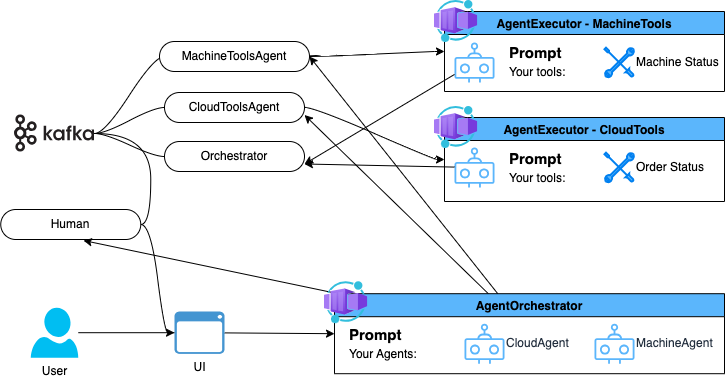

# Async AI Agents and Humans in the loop

This project demonstrates how to implement a human in the loop pattern using multiple asynchronous AI agents.



## Deploy Infrastructure

```
echo "log into azure dev cli - only once"
azd auth login

echo "provisioning all the resources with the azure dev cli"
azd up

echo "get and set the value for AZURE_ENV_NAME"
source <(azd env get-values | grep AZURE_ENV_NAME)

echo "building and deploying the streamlit user interface"
bash ./azd-hooks/deploy.sh sql-agents $AZURE_ENV_NAME
```

## Starting up

```
conda create -n ai-orchestrator python=3.12

conda activate ai-orchestrator

python -m pip install -r requirements.txt   

python -m streamlit run app.py --server.port=8000
```
